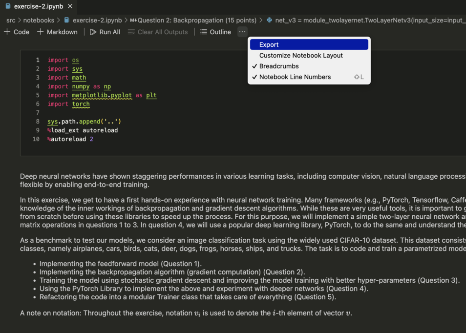
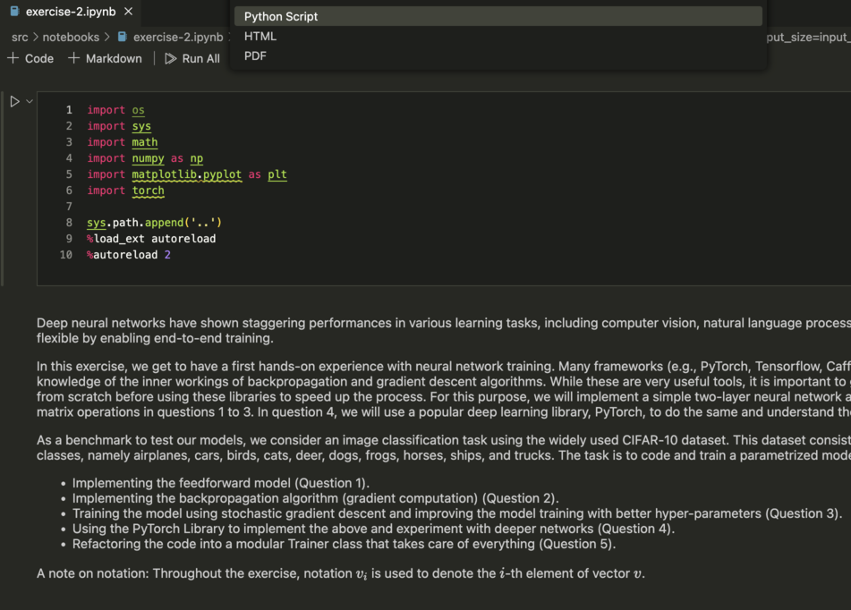

# HLCV SS23 - GPU Tutorial 
  

### Connect to the VPN of UdS 

The GPU server is only accessible using the UdS network. 

To access from outside the network, you need to connect to the VPN of UdS, following the instructions here: 

https://www.hiz-saarland.de/dienste/vpn 

### Login to the GPU server 

In the Terminal, use the following command to login to the GPU server: 

```
ssh hlcv_teamxxx@conduit.cs.uni-saarland.de 
```

Please replace hlcv_teamxxx with your own account. 

You can change your password using: 

```
passwd 
```

### Install Miniconda

Install Miniconda using the Linux installer from https://docs.conda.io/en/latest/miniconda.html

For example, with PyTorch 3.10, you can do the following:

```
wget https://repo.anaconda.com/miniconda/Miniconda3-py310_23.3.1-0-Linux-x86_64.sh
chmod +x Miniconda3-py310_23.3.1-0-Linux-x86_64.sh
./Miniconda3-py310_23.3.1-0-Linux-x86_64.sh
```

### Clone your GitLab repository to the server

```
git clone https://gitlab.cs.uni-saarland.de/hlcv/ss23/teamN
cd teamN
mkdir condor_logs
```

### Pull the demo from the upstream

```
git fetch upstream
git merge upstream/main
cd gpu_instructions
```

### Create a conda environment

We have provided an `environment.yml` file with many of the packages you may need (which you might have already used for the assignments). Alternatively, you can create your own environment and install all the packages yourself.

```
conda env create -f environment.yml
conda activate hlcv-ss23
```

### Prepare a simple PyTorch example script

The relevant files are `demo.py`, `execute.sh`, and `pytorch_docker.sub`.

#### `demo.py`

This is a simple script to test that you are able to run a program on the HTCondor cluster.

The first line of the Python script should be:

```
#!/usr/bin/env python
```


#### `execute.sh`

This is a bash script that will run the Python script under the appropriate conda environment and pass any necessary arguments.

Set the following two variables:

```
# Path to the `.py` file you want to run
PYTHON_SCRIPT_PATH="/home/hlcv_teamxxx/teamN/gpu_instructions/"
# Path to the Python binary of the conda environment
CONDA_PYTHON_BINARY_PATH="/home/hlcv_teamxxx/miniconda3/envs/hlcv-ss23/bin/python"
```


#### `pytorch_docker.sub`

This describes the job to submit to HTCondor.


Check the following lines:

Specify the Python script to run. This can also include arguments.
```
# Example without arguments
arguments               = demo.py

# Example with arguments
arguments               = demo.py arg1 arg2
```

Specify the paths for the output, error, and log files 
```
output                  = /home/hlcv_teamxxx/teamN/condor_logs/demo.$(ClusterId).$(ProcId).out
error                   = /home/hlcv_teamxxx/teamN/condor_logs/demo.$(ClusterId).$(ProcId).err
log                     = /home/hlcv_teamxxx/teamN/condor_logs/demo.$(ClusterId).log
```

### Run the example


Submit your job 

```
condor_submit pytorch_docker.sub 
```


Check the state of your job in the condor queue: 

```
condor_q 
```


Analyze how many machines can run your job or if there are problems: 


```
condor_q -analyze 
```
```
condor_q -better 
```

Overview of machines in the cluster: 

```
condor_status 
```

To terminate a job: 

  1. Find the job ID: 

```
condor_q –nobatch 
```

  2.  Terminate the job: 
    
```
condor_rm <job_id> 
```

The output and error logs can be viewed in their respective files at the paths specified in `pytorch_docker.sub`.

To monitor the output file when a job is running:

```
condor_tail -f <job_id>
```

### Converting notebooks to .py files 

Since the assignments use Jupyter Notebooks, you may need to first convert them to `.py` files before submitting them to the server. This can be done as follows:

 


### Using interactive jobs

Interactive jobs can be used for debugging. Note that these jobs are killed automatically after one hour to allow other users to get an interactive slot. So please don’t directly run your code with an interactive job. 


You can set up breakpoints using the Python Debugger library: 

```
import pdb 

pdb.set_trace() 
```

To submit an interactive job: 

```
condor_submit -i pytorch_docker_interactive.sub 
```

To run the code for debugging: 

```
CUDA_VISIBLE_DEVICES=0 python demo.py 
```


### Notes 

  -  There is a restriction on the number of GPUs that can be used at a time. That means each team can only run one job on one GPU in parallel. Additional jobs get queued. If they request more resources, the jobs will be idle indefinitely. There is no restriction on job duration, which means the jobs don’t get killed automatically after a certain time. 

  -  Further readings for the HTCondor (i.e., the system used for the GPU server): https://htcondor.readthedocs.io/en/latest/ 

### Contact 

For further questions, you may contact the TAs of HLCV using this mailing list: 

hlcv-ss23@lists.mpi-inf.mpg.de. 

 

 
